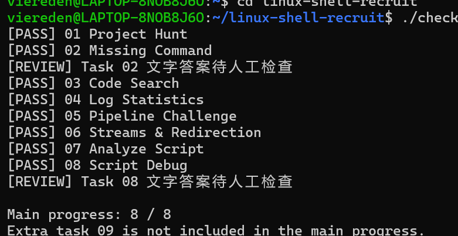

## Task

----
## 有关学习笔记记录
> ### 说明：在完成这道招新题的过程中，我使用了AI作为学习工具。但绝对不是让AI直接完成这道招新题。而是借助AI理解shell命令原理，我也会跟AI讨论它提供的代码有没有另外的写法（例如：能不能直接将查看到的结果用prinf写入文件；用cut切割所需子块）为达到利用招新题和AI学习的目的，特此亲手敲下下learning.md。记录每一项任务跑成功的代码，这行代码是如何得到的以及相关知识的笔记用于学习提高和复习）。所有命令均由我亲手敲入，调试，理解。也在这过程中发现了很多小错误，比如空格和引号。此次提交是第二次做这道题（第一次由于未能达到预期学习效果，在做完任务六后选择删除从头开始）（learning.md已被我一并放在linux-shell-recruit仓库根目录中，里面可能会有我手误敲下的错字，我会在之后复习中发现并改正）